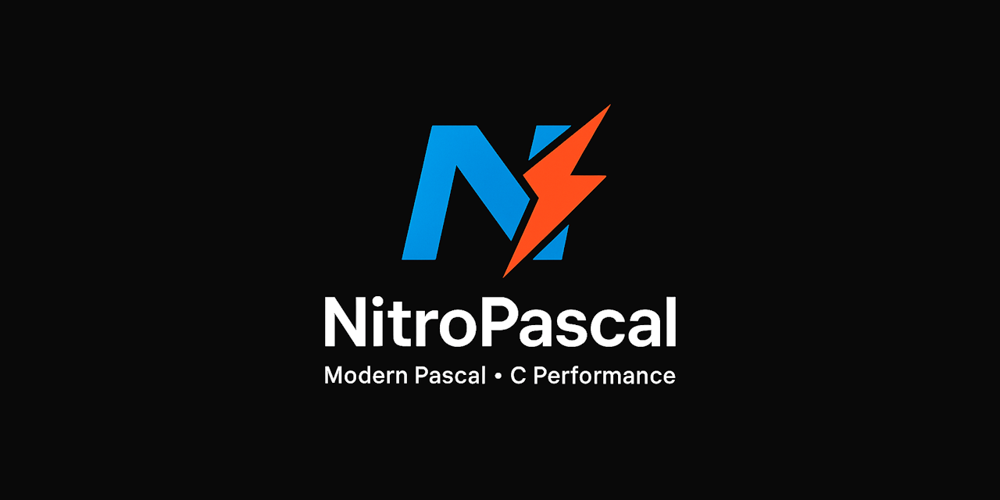

<div align="center">



[](https://discord.gg/Wb6z8Wam7p) [](https://bsky.app/profile/tinybiggames.com)

</div>

## What is NitroPascal?

**NitroPascal is Object Pascal. It compiles to native binaries via C++23.**

NitroPascal is a full-featured Object Pascal compiler built entirely on top of [Parse()](https://github.com/tinyBigGAMES/ParseKit) - the compiler construction toolkit. It exists to prove a point: **a complete, production-quality language can be built with Parse() without touching a parser generator, a lexer generator, or a custom pipeline.** Every stage - tokenization, Pratt parsing, semantic analysis, C++23 code generation, and native compilation via Zig - is driven through a single Parse() configuration object.

```pascal
program Hello;

begin
  WriteLn('Hello from NitroPascal!');
end.
```

NitroPascal is not a toy. It is a working Pascal compiler that handles programs, procedures, functions, typed variables, arrays, sets, pointers, records, string manipulation, math, and memory management - all the things you would expect from a real Pascal implementation. The generated output is clean C++23, compiled to a native Win64 or Linux64 binary by the Zig/Clang backend that ships with ParseKit.

> **NitroPascal is the reference showcase for the [Parse() Compiler Construction Toolkit](https://github.com/tinyBigGAMES/ParseKit).** If you want to see what a full language looks like when built on Parse(), this is it. Read the source. Every grammar rule, every semantic check, every code emitter is a Parse() registration call - nothing more.

## 🚧 Under Construction

NitroPascal is actively developed. The foundation is solid and the core language works. More features are being added continuously.

### ✅ What Works Today

- **Program structure** - `program`, `var`, `const`, `type`, `begin..end.`
- **Primitive types** - `Integer`, `Double`, `Boolean`, `Char`, `String`
- **Procedures and functions** - full declarations, parameters (`const`, `var`, `out`), `Result` return convention
- **Control flow** - `if/then/else`, `while/do`, `for/to/downto`, `repeat/until`, `case/of`, `break`, `continue`, `exit`
- **Arrays** - fixed arrays with arbitrary index bounds, dynamic arrays, `SetLength`
- **Sets** - Pascal set types, `Include`, `Exclude`, `in` operator
- **Pointers** - typed pointer declarations, `^T`, `@expr`, dereference, pointer type aliases
- **Records** - field declarations, nested records, pass by value/ref/out, functions returning records
- **Literals** - integer, real, string, char (`#65`), hex (`$FF`), boolean, `nil`
- **Intrinsics** - `Inc`, `Dec`, `Ord`, `Chr`, `Succ`, `Pred`, `Odd`, `Assigned`, `Length`, `Copy`, `Pos`, `UpperCase`, `LowerCase`, `Trim`, `IntToStr`, `StrToInt`, `StrToIntDef`, `StringOfChar`, `Abs`, `Sqr`, `Sqrt`, `Max`, `Min`, `Round`, `Trunc`, `New`, `Dispose`
- **I/O** - `WriteLn`, `Write`

### 🔜 Planned / In Progress

- Classes and objects with inheritance and virtual dispatch
- Exception handling (`try/except/finally`)
- Enumerations
- Units and `uses` clause
- String escape sequences and extended string handling
- More intrinsics and RTL coverage
- Linux64 cross-compile support

## 🎯 Why NitroPascal?

NitroPascal serves two audiences.

**If you write Pascal**, NitroPascal gives you a path from `.pas` source to a native binary without a legacy toolchain. Write standard Object Pascal, get a fast, small native executable. No Delphi license required to run compiled programs. No FPC install. Just the NitroPascal compiler and the bundled Zig backend.

**If you build languages**, NitroPascal is the definitive answer to *"can Parse() handle a real language?"* Browse `src/NitroPascal.Lexer.pas`, `src/NitroPascal.Grammar.pas`, `src/NitroPascal.Semantics.pas`, and `src/NitroPascal.CodeGen.pas`. Every feature maps directly to Parse() API calls. There is no magic, no custom parser, no hand-rolled AST infrastructure. If NitroPascal can implement full Pascal on Parse(), your language can too.

## 🔄 How It Works

NitroPascal is four source files and Parse():

```
NitroPascal.Lexer.pas     - keyword and operator registration
NitroPascal.Grammar.pas   - Pratt grammar rules (prefix + infix + statement handlers)
NitroPascal.Semantics.pas - type assignment and symbol resolution rules
NitroPascal.CodeGen.pas   - C++23 emitters for every AST node kind
```

Each file is a set of `AParse.Config().Register*()` calls. That is the entire compiler. Parse() provides the tokenizer, the Pratt parser engine, the scope-aware semantic walker, the C++23 IR builder, and the Zig compilation backend. NitroPascal provides the language definition.

```
Pascal source
      |
      v
+-----------+  tokens   +----------+   AST        +------------+
|   Lexer   | --------> |  Parser  | -----------> | Semantics  |
| (Parse()) |           | (Parse())|              | (Parse())  |
+-----------+           +----------+              +------------+
                                                        |
                                            enriched AST (type, scope, decl)
                                                        |
                                                        v
                                                 +-----------+
                                                 |  CodeGen  | --> .h + .cpp
                                                 | (Parse()) |
                                                 +-----------+
                                                       |
                                                       v
                                                  +---------+
                                                  |   Zig   | --> native binary
                                                  +---------+
```

## 🚀 Getting Started

### Prerequisites: Directory Layout

NitroPascal requires the [ParseKit](https://github.com/tinyBigGAMES/ParseKit) sources to be present as a **sibling directory** alongside NitroPascal. The Delphi project references ParseKit's source directly. The required layout is:

```
C:\Dev\                         <- or any root you choose
  ParseKit\                     <- ParseKit repo root (contains src\, bin\, etc.)
  NitroPascal\                  <- NitroPascal repo root (contains src\, bin\, etc.)
```

Both repos must share the same parent directory. If they do not, the Delphi project will not compile.

### Step 1: Get ParseKit

**Option 1: [Download ParseKit ZIP](https://github.com/tinyBigGAMES/ParseKit/archive/refs/heads/main.zip)**

**Option 2: Git clone**
```bash
git clone https://github.com/tinyBigGAMES/ParseKit.git
```

Place (or clone) it so the folder structure matches the layout above.

### Step 2: Get NitroPascal

**Option 1: [Download NitroPascal ZIP](https://github.com/tinyBigGAMES/NitroPascal/archive/refs/heads/main.zip)**

**Option 2: Git clone**
```bash
git clone https://github.com/tinyBigGAMES/NitroPascal.git
```

### Step 3: Download the Toolchain

**The toolchain must be downloaded separately.** It contains the Zig compiler and C++ runtime that NitroPascal uses to compile generated code to native binaries. Without it, the pipeline cannot produce binaries.

**[Download parsekit-toolchain.zip](https://github.com/tinyBigGAMES/ParseKit/releases/download/toolchain-latest/parse-toolchain.zip)**

Unzip the toolchain directly into the **root of your NitroPascal directory**:

```
NitroPascal\          <- repo root
  bin\                <- toolchain contents go here (zig\, res\, etc.)
  src\
  ...
```

> **This is a permanent release entry.** The URL will never change. When the toolchain is updated, the same release entry is replaced in place. You always download from the same link.

#### System Requirements

| | Requirement |
|---|---|
| **Host OS** | Windows 10/11 x64 |
| **Linux target** | WSL2 + Ubuntu (`wsl --install -d Ubuntu`) |
| **Delphi** | Delphi 11 Alexandria or later (to build from source) |

### Step 4: Open in Delphi and Build

1. Open `src\NitroPascal.groupproj` in Delphi
2. Build all projects in the group (`NitroPascal`, `Testbed`)
3. The `Testbed` project compiles and runs all tests in `bin\res\tests\` and prints colour-coded pass/fail results

### Step 5: Compile a Pascal Program

```bash
cd NitroPascal\bin
testbed
```

Or call the compiler programmatically:

```delphi
uses
  NitroPascal;

var
  LCompiler: TNitroPascal;
begin
  LCompiler := TNitroPascal.Create();
  try
    LCompiler.SetSourceFile('hello.pas');
    LCompiler.SetOutputPath('output');
    if LCompiler.Compile(True) then
      WriteLn('Done.')
    else
      WriteLn('Failed: ', LCompiler.GetLastError());
  finally
    LCompiler.Free();
  end;
end;
```

## 📖 Language Sample

```pascal
program Showcase;

var
  i:    Integer;
  s:    String;
  arr:  array[1..5] of Integer;
  flags: set of (0..7);

function Factorial(const AValue: Integer): Integer;
begin
  if AValue <= 1 then
    Result := 1
  else
    Result := AValue * Factorial(AValue - 1);
end;

begin
  // Arithmetic and string intrinsics
  s := 'Hello, NitroPascal!';
  WriteLn(UpperCase(s));
  WriteLn('Length: ', IntToStr(Length(s)));

  // Arrays (1-based indexing)
  for i := 1 to 5 do
    arr[i] := i * i;
  WriteLn('Squares: ', arr[1], ' ', arr[2], ' ', arr[3], ' ', arr[4], ' ', arr[5]);

  // Sets
  flags := [1, 3, 5];
  Include(flags, 7);
  if 3 in flags then
    WriteLn('3 is in flags');

  // Recursion
  for i := 1 to 7 do
    WriteLn(IntToStr(i) + '! = ' + IntToStr(Factorial(i)));
end.
```

## 🤝 Contributing

NitroPascal is an open project. Whether you are fixing a bug, improving documentation, adding a language feature, or writing a new test case, contributions are welcome.

- **Report bugs**: Open an issue with a minimal reproduction. The smaller the example, the faster the fix.
- **Suggest features**: Describe the use case first, then the syntax you have in mind. Features that emerge from real problems get traction fastest.
- **Submit pull requests**: Bug fixes, documentation improvements, new test cases, and well-scoped features are all welcome. Keep changes focused.
- **Add tests**: The `bin\res\tests\` directory contains `.pas` test files. New tests that cover edge cases or new features are always valuable.

Join the [Discord](https://discord.gg/Wb6z8Wam7p) to discuss development, ask questions, and share what you are building.

## 💙 Support the Project

NitroPascal is built in the open. If it saves you time or sparks something useful:

- ⭐ **Star the repo**: it costs nothing and helps others find the project
- 🗣️ **Spread the word**: write a post, mention it in a community you are part of
- 💬 **[Join us on Discord](https://discord.gg/Wb6z8Wam7p)**: share what you are building and help shape what comes next
- 💖 **[Become a sponsor](https://github.com/sponsors/tinyBigGAMES)**: sponsorship directly funds time spent on the compiler, runtime, and documentation

## 📄 License

NitroPascal is licensed under the **Apache License 2.0**. See [LICENSE](https://github.com/tinyBigGAMES/NitroPascal?tab=readme-ov-file#Apache-2.0-1-ov-file) for details.

Apache 2.0 is a permissive open source license that lets you use, modify, and distribute NitroPascal freely in both open source and commercial projects. You are not required to release your own source code. You can embed NitroPascal into a proprietary product, ship it as part of a commercial tool, or build on top of it without restriction.

The license includes an explicit patent grant, meaning contributors cannot later assert patent claims against you for using their contributions. Attribution is required - keep the copyright notice and license file in place - but beyond that, NitroPascal is yours to build with.

## 🔗 Links

- [ParseKit - the toolkit that powers NitroPascal](https://github.com/tinyBigGAMES/ParseKit)
- [Discord](https://discord.gg/Wb6z8Wam7p)
- [Bluesky](https://bsky.app/profile/tinybiggames.com)
- [tinyBigGAMES](https://tinybiggames.com)

<div align="center">

**NitroPascal**™ - A full-featured Object Pascal compiler built on [Parse()](https://github.com/tinyBigGAMES/ParseKit).

Copyright © 2025-present tinyBigGAMES™ LLC
All Rights Reserved.

</div>
